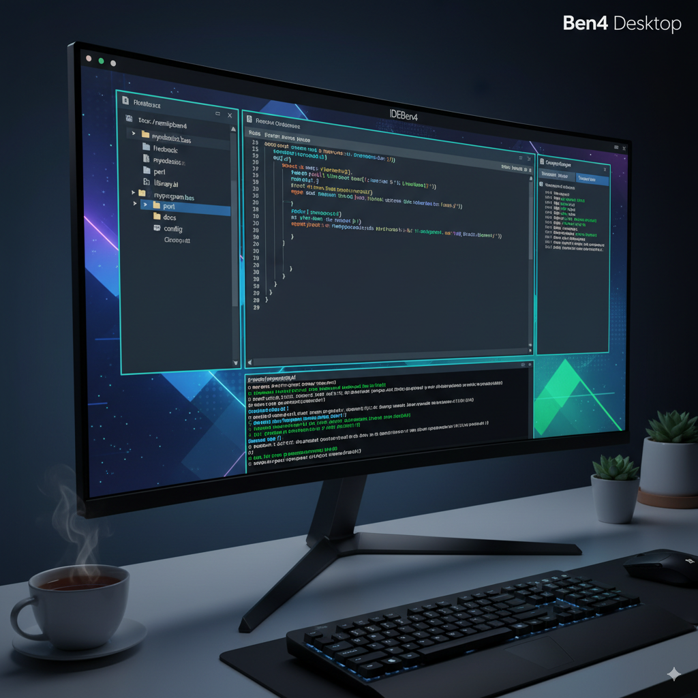

Here's a possible `README.md` for your `IDEBen4` project, incorporating the details you've provided:


---

# IDEBen4 - A FreeBASIC and Perl Development Environment

## Project Overview

IDEBen4 is a custom-tailored development environment designed for efficient coding in **FreeBASIC** and **Perl**. This setup is optimized for the **Ben4 Desktop** and provides a streamlined workflow for developing and managing projects. The primary project directory is located at `./nemtipben4`.

## Features

*   **FreeBASIC Integration:** Configure for compiling, debugging, and running FreeBASIC applications.
*   **Perl Scripting Support:** Seamless execution and testing of Perl scripts.
*   **Ben4 Desktop Friendly:** Designed to integrate well with the Ben4 Desktop environment.
*   **Project Structure:** Organized to keep all development files for `./nemtipben4` in one accessible location.

## Getting Started

### Prerequisites

To get IDEBen4 up and running, ensure you have the following installed on your Ben4 Desktop:

*   **FreeBASIC Compiler:** The FreeBASIC compiler and associated tools.
*   **Perl Interpreter:** A working Perl installation.

### Installation & Setup

1.  **Clone the Repository (if applicable):**
    ```bash
    git clone [your-repository-url] nemtipben4
    cd nemtipben4
    ```
    (If this is not a git repo, you'll just place the files directly into the `nemtipben4` directory).

2.  **Verify FreeBASIC Installation:**
    Ensure you can compile a simple FreeBASIC program.
    ```bash
    fbc -version
    ```

3.  **Verify Perl Installation:**
    Ensure you can run a simple Perl script.
    ```bash
    perl -v
    ```

## Project Structure (within `./nemtipben4`)

While the exact structure will evolve with your project, here's a suggested starting point:

```
nemtipben4/
├── freebasic/              # FreeBASIC source files (.bas, .bi)
│   ├── src/
│   ├── bin/                # Compiled FreeBASIC executables
│   └── lib/                # FreeBASIC libraries
├── perl/                   # Perl scripts (.pl, .pm)
│   ├── scripts/
│   └── modules/            # Perl modules
├── docs/                   # Project documentation, notes, etc.
├── config/                 # Configuration files for the IDE/environment
├── resources/              # Images, assets, data files
├── tests/                  # Unit tests for both languages
├── README.md               # This file
└── build.sh / makefile     # (Optional) Build scripts
```

## Usage

### Developing with FreeBASIC

*   **Edit:** Use your preferred text editor on Ben4 Desktop to modify FreeBASIC `.bas` files.
*   **Compile:** Use the `fbc` command in your terminal to compile your FreeBASIC code.
    ```bash
    fbc freebasic/src/myprogram.bas -o freebasic/bin/myprogram
    ```
*   **Run:** Execute your compiled program.
    ```bash
    ./freebasic/bin/myprogram
    ```

### Developing with Perl

*   **Edit:** Use your preferred text editor to modify Perl `.pl` or `.pm` files.
*   **Execute:** Run your Perl scripts directly using the `perl` interpreter.
    ```bash
    perl perl/scripts/myscript.pl
    ```

## Contributing

(Add details here if this is an open-source project or if others will be contributing to your internal development.)

## License

(Specify your chosen license here, e.g., MIT, GPL, or "Proprietary")

---

**Example image of a Ben4 Desktop with an IDE open:** 